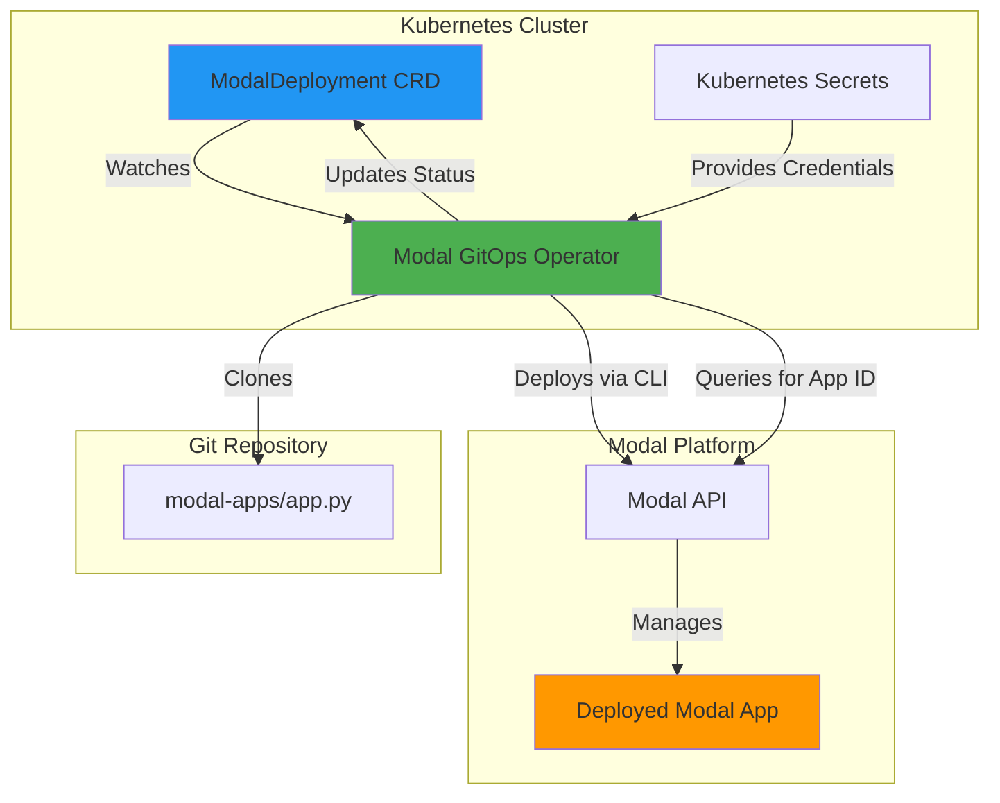
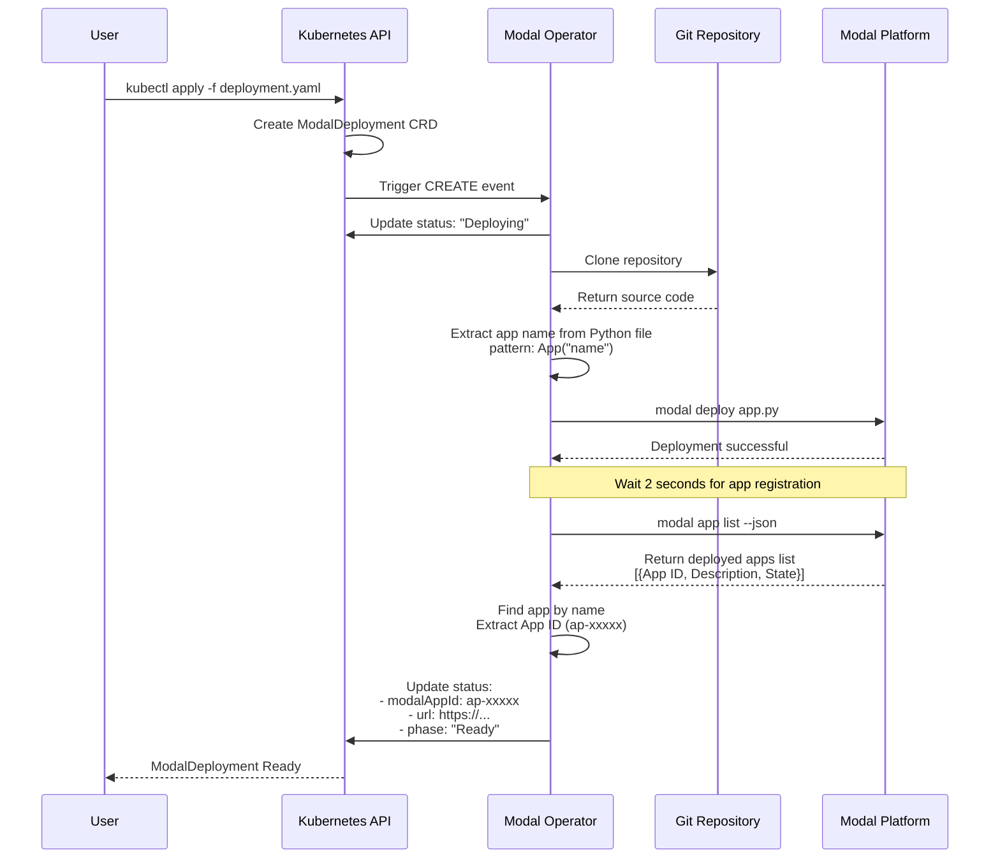
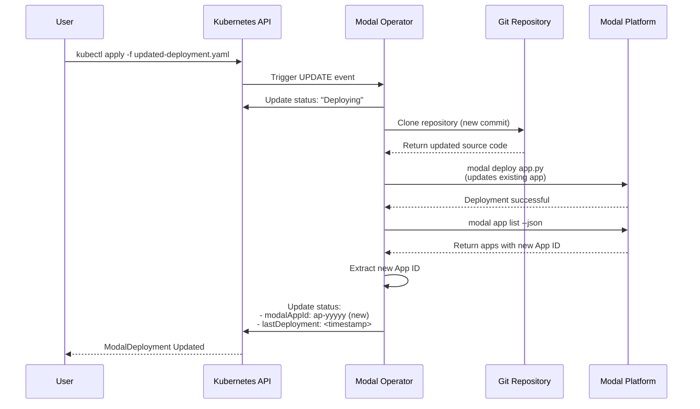
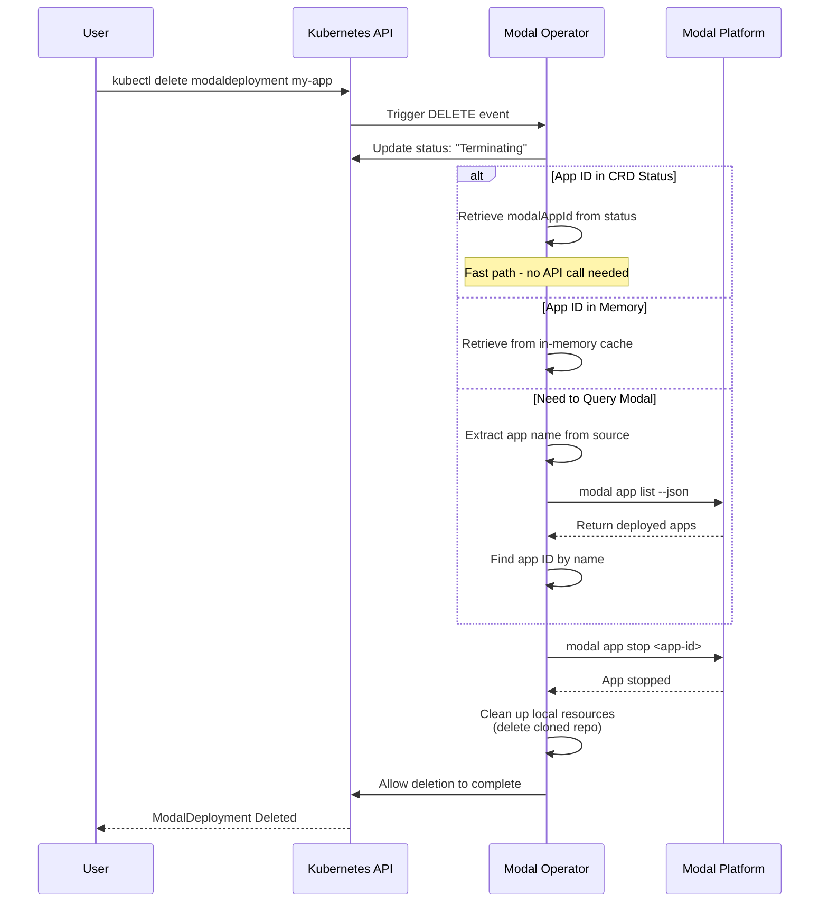
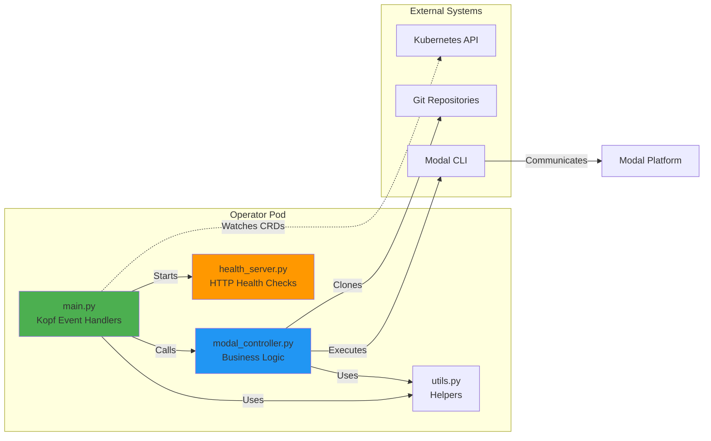
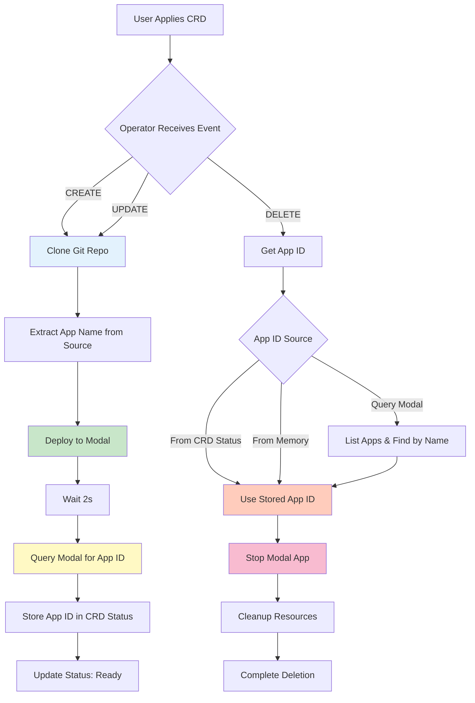
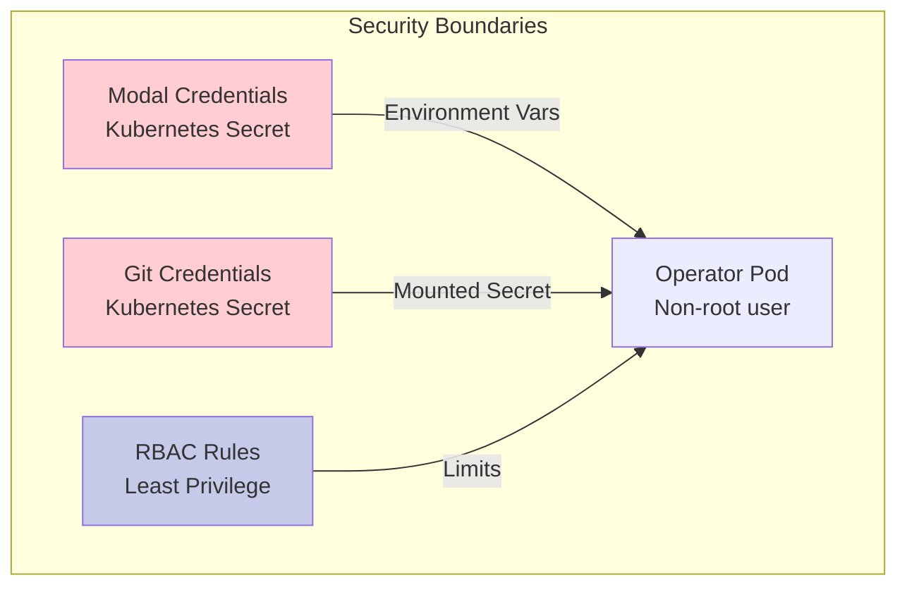
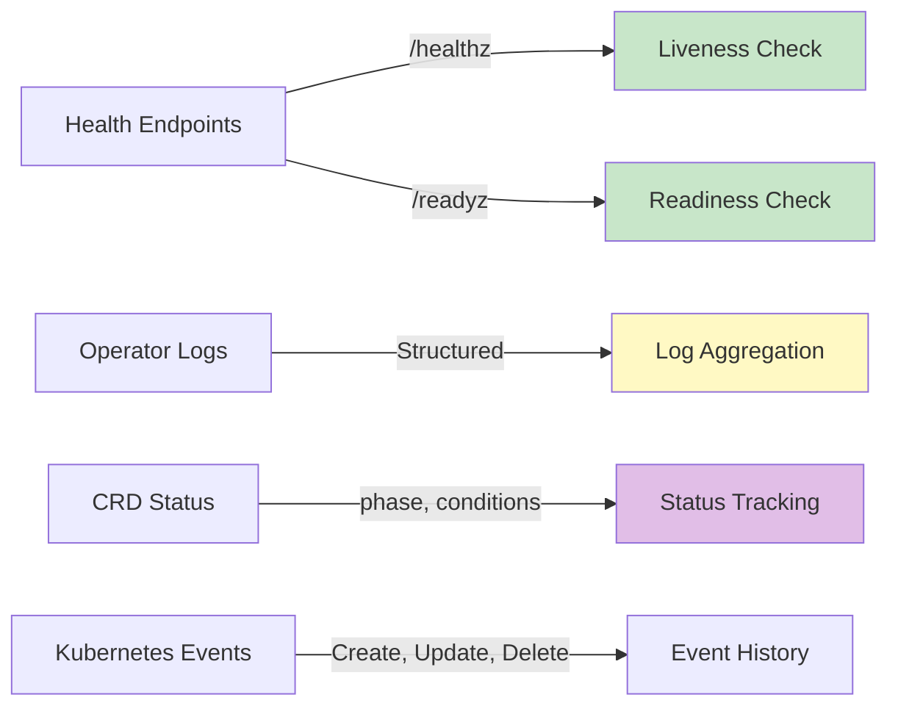

# Modal GitOps Operator Architecture

## System Overview

## Deployment Flow

## Update Flow

## Deletion Flow

## Component Architecture

## Data Flow

## Key Design Decisions

### 1. App ID Storage

**Problem**: User's Modal app name may differ from CRD `appName`  
**Solution**: Extract actual app name from Python file and query Modal API for app ID  
**Benefit**: Reliable deletion even when names don't match

### 2. Deployment Strategy

**Problem**: Need to deploy user's Modal apps without modification  
**Solution**: Use `modal deploy` directly on user's file  
**Benefit**: Full Modal feature support, no wrapper code needed

### 3. Deletion Reliability

**Problem**: Operator restarts lose in-memory state  
**Solution**: Store app ID in CRD status (persisted in etcd)  
**Benefit**: Deletion works across operator restarts

### 4. Private Repository Support

**Problem**: Users need access to private Git repos  
**Solution**: Support both SSH keys and Personal Access Tokens via Kubernetes secrets  
**Benefit**: Secure credential management using Kubernetes native secrets

## Security Considerations

### Security Features

1. **Non-root Execution**: Operator runs as user `operator` (UID 1000)
2. **Secret Management**: Credentials stored in Kubernetes secrets
3. **RBAC**: Minimal permissions (only ModalDeployments CRD access)
4. **Network Policies**: Can be restricted to necessary endpoints
5. **Read-only Filesystem**: Could be enabled (Modal CLI writes to ~/.modal)

## Failure Handling

| Scenario           | Behavior                             | Recovery                                      |
| ------------------ | ------------------------------------ | --------------------------------------------- |
| Git clone fails    | Mark as Failed, update status        | User fixes repo/credentials, operator retries |
| Modal deploy fails | Mark as Failed, show error in status | User fixes app code, operator retries         |
| App ID not found   | Warning logged, deletion continues   | Non-blocking - allows resource cleanup        |
| Modal stop fails   | Warning logged, deletion continues   | Non-blocking - prevents stuck deletions       |
| Operator restart   | Retrieves state from CRD status      | App ID persisted, deletion still works        |

## Monitoring Points

### Observable Metrics

- **Health**: `/healthz` (liveness), `/readyz` (readiness) on port 8081
- **Status**: CRD `status.phase` and `status.conditions`
- **Logs**: Structured logging with INFO/WARNING/ERROR levels
- **Events**: Kubernetes events for major lifecycle changes

## Performance Characteristics

| Operation        | Time   | Notes                   |
| ---------------- | ------ | ----------------------- |
| Git Clone        | 1-5s   | Depends on repo size    |
| Modal Deploy     | 5-30s  | Depends on dependencies |
| App ID Query     | 1-2s   | Single API call         |
| Total Deployment | 10-40s | End-to-end              |
| Deletion         | 1-3s   | With cached app ID      |

## Future Enhancements

- [ ] **Automatic git polling and reconciliation** - [Issue #5](https://github.com/mishraprafful/gitops-modal/issues/5)
  - Watch for git commit changes
  - Configurable polling interval
  - Track git revision in CRD status
- [ ] Prometheus metrics exposure - [Issue #7](https://github.com/mishraprafful/gitops-modal/issues/7)
- [ ] Webhook validation for CRDs - [Issue #8](https://github.com/mishraprafful/gitops-modal/issues/8)
